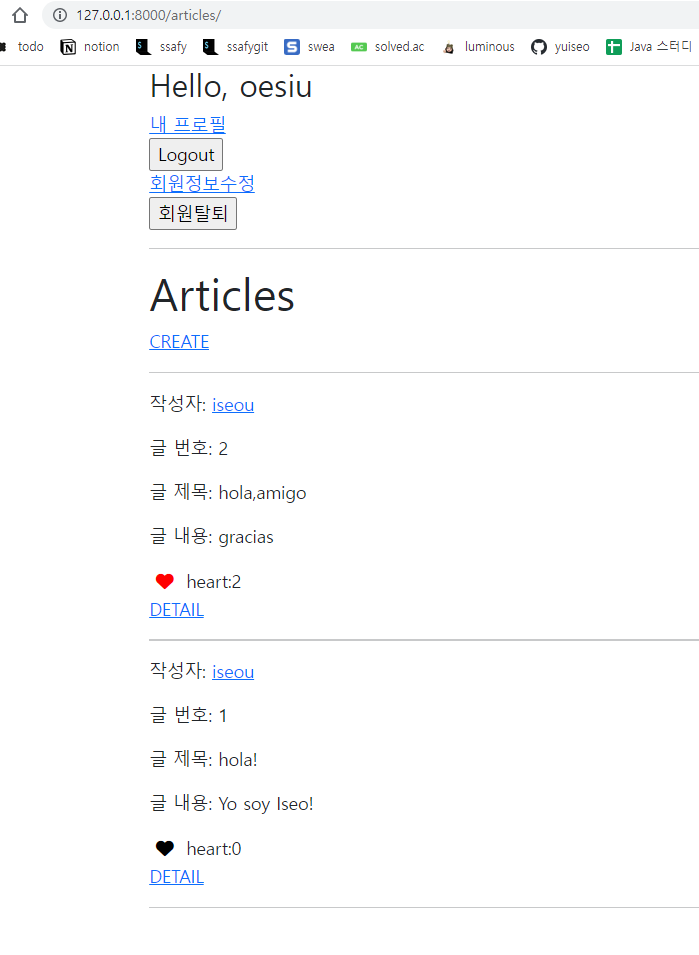

# Today I Learn 220419 

오늘도 장고 워크샵을 하면서 또 바보같은 경험을 했다.

내가 계정을 두개 만들었는데 다른 계정으로 좋아요를 눌러놓은 것을 잊고있던게 원인이었다.

좋아요 수를 출력하는 기능을 만들면서 현재 계정으로 좋아요를 누르지 않았는데 좋아요 수가 1로 출력되어서 출력에 이상이 있고 코드를 잘못 작성한 줄 알았다.

그래서 조금씩 고치다 보니 과제 수정 commit만 4번 이상 했다. 다시 생각해보니 다른 계정으로 좋아요 수를 눌렀을 수도 있다는 점이 불현듯 스쳐갔다. 

오류때문에 if문 안에 좋아요 수를 넣었다가, article.like_user라고도 만들어봤다가 여러 시도를 했었는데, 원인을 알고 나서 다시 if문 바깥으로 빼주고 하니 정상적으로 출력되었다. 오류라고 생각한게 단순 실수였지만 원인을 알고나니 속이 후련했다.

```python



  <h1>Articles</h1>
  
    <a href="">CREATE</a>
  
    <a href="">[새 글을 작성하려면 로그인 하세요]</a>
  
  <hr>
  
     작성자 링크로 가야해서 articles.user.username 
    <p>작성자: <a href="">{{ article.user }}</a></p>
    <p>글 번호: {{ article.pk }}</p>  
    <p>글 제목: {{ article.title }}</p>
    <p>글 내용: {{ article.content }}</p>
    <div>
      <form action="" method = "POST">
        
        
          <button type="submit">
            <i class="fa-solid fa-heart" style=color:red;></i>
            
          </button>

          
        
          <button type="submit">
            <i class="fa-solid fa-heart" ></i>
          </button>

        
        heart:{{article.like_users.all|length}}
      </form>
    </div>
    <div>
       
    </div>
    <a href="">DETAIL</a>
    <hr>
  


```



