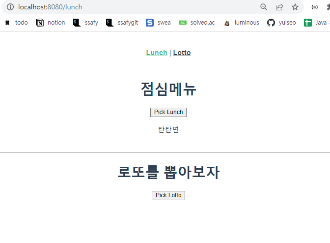
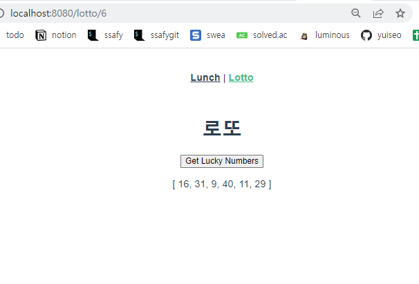

# workshop - Vue CLI

오늘은 Node.js를 이용해 Vue Router로 로또번호 추첨기(?)와 점심메뉴를 고르는 과제를 해보았다.  javascript만을 이용해 이 페이지를 구현할 때는 사실 좀 힘들었는데, `lodash`를 import해서 쓰니 숫자를 가져오는것도 훨씬 저번보다 편했다!또한 점심메뉴 고르는 것도 `lodash`를 사용하니 코드가 한결 간략해진거 같다. 또한, Vue CLI를 통해 화면을 구현하니 전보다 훨씬 깔끔하고 비동기화 시키는 것도 알아서 되니까 좋은거 같다. 지난주와 그 전 주에는 javascript에 적응하느라 힘들었지만 프레임워크를 사용해 구현하는건 재밌는거 같다.






### App.vue

```vue
<template>
  <div id="app">
    <nav>
      <router-link :to="{name: 'lunch'}">Lunch</router-link> |
      <router-link :to="{name: 'lotto',parmas:{ lottoNum:6 } }">Lotto</router-link>
    </nav>
    <router-view/>
  </div>
</template>

<style>
#app {
  font-family: Avenir, Helvetica, Arial, sans-serif;
  -webkit-font-smoothing: antialiased;
  -moz-osx-font-smoothing: grayscale;
  text-align: center;
  color: #2c3e50;
}

nav {
  padding: 30px;
}

nav a {
  font-weight: bold;
  color: #2c3e50;
}

nav a.router-link-exact-active {
  color: #42b983;
}
</style>

```

### router/index.js

```json
import Vue from 'vue'
import VueRouter from 'vue-router'
import LunchView from '../views/LunchView.vue'
import LottoView from '../views/LottoView.vue'

Vue.use(VueRouter)

const routes = [
  {
    path: '/lunch',
    name: 'lunch',
    component: LunchView
  },
  {
    path: '/lotto/6',
    name: 'lotto',
    component:LottoView

  }
]

const router = new VueRouter({
  mode: 'history',
  base: process.env.BASE_URL,
  routes
})

export default router

```

### views/LunchView.vue

```vue
<template>
  <div>
    <h1>점심메뉴</h1>
    <button @click="pickLunch">Pick Lunch</button>
    <p>{{ selectedLunchMenu }}</p>
    <br>
    <hr>
    <h1>로또를 뽑아보자</h1>
    <button @click="moveToLotto">Pick Lotto</button>
  </div>
</template>

<script>
import _ from 'lodash'

export default {
  name: 'LunchView',
  data: function(){
    return { selectedLunchMenu:''} 
  },
  methods: {
    moveToLotto() {
      this.$router.push({ name: 'lotto'})
    },
    pickLunch() {
      this.selectedLunchMenu= _.sample(['피자','치킨','삼겹살','꿔바로우','탄탄면','라멘','연어초밥','막국수'])
    }
  }
}
</script>

<style>

</style>
```


### LottoView.vue

```vue
<template>
  <div>
    <h1>로또</h1>
    <button @click="getLuckyNums">Get Lucky Numbers</button>
    <p>{{ selectedLuckyNums }}</p>
  </div>
</template>

<script>
import _ from 'lodash'

export default {
  name:'LottoView',
  data: function() {
    return {
      selectedLuckyNums: [],
    }
  },
  methods: {
    getLuckyNums: function(){
      const numbers = _.range(1,46)
      this.selectedLuckyNums = _.sampleSize(
        numbers,
        6,
      )
    }
  }

}
</script>

<style>

</style>