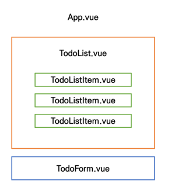
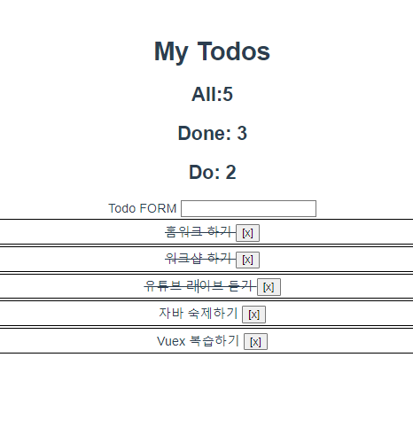

# Today I Learn 220511

오늘은 Vuex에 대해 학습하였다.

Vuex를 사용하는 이유는 다양한 컴포넌트들이 있을 때 기존의 Vue환경은 각각의 컴포넌트마다 data를 들고 있지만, 그렇게 되면 emit과 props를 계속 거쳐 통신해야 하고 나와 같은 동기 component와 대화할 때도 여러명을 거쳐 통신해야 한다.

이러한 불편함을 해소하기 위해 Vuex를 사용한다! Vuex에서는 index.js라는 곳에서 (마치 공용통장) data를 관리한다. 그래서 빠르고 효율적인 통신이 가능하다. 하지만 공용으로 사용하다보니 편리성은 증가 된 반면 상태관리를 잘 해야하는 단점이 생겼다!

어쨋든, Vuex의 core 개념은 다음과 같다.

##### - State

​	중앙에서 관리하는 모든 상태 정보 (data)

##### -Getters

​	state를 변경하지 않고 활용하여 계산을 수행 (computed 속성과 유사)

##### - Mutations

​	실제로 state를 변경하는 유일한 방법

##### -Actions

​	Mutations와 유사하지만 다음과 같은 차이점이 있음 

	1. state를 변경하는 대신 mutations를 commit() 메서드로 호출해서 실행 
	1.  mutations와 달리 비동기 작업이 포함될 수 있음 (Backend API와 통신하여 Data Fetching 등의 작업 수행)

이 개념들을 이용해 Vuex를 이용한 ToDo App을 구현하는 실습을 했다.






최상위 루트 - App.vue

App.vue의 자식 Component : TodoList.vue, TodoForm.vue

TodoList.vue의 자식 Component: TodoListItem.vue

### ❕index.js - Vuex core concepts가 작성

```
import Vue from 'vue'
import Vuex from 'vuex'

import createPersistedState from 'vuex-persistedstate'

Vue.use(Vuex)

export default new Vuex.Store({
  plugins: [
    createPersistedState()
  ],
  state: { //data
    todos:[],
  },
  getters: { //computed
    //현재 끝난 일의 개수
    //state를 기반으로 추출해내기 때문에 state를 인자로!
    allTodosCount(state){
      return state.todos.length
    },
    completedTodosCount(state){
      return state.todos.filter(todo=>{
        return todo.isCompleted
      }).length
    },
    uncompletedTodosCount(state){
      return state.todos.filter(todo=>{
        return !todo.isCompleted
      }).length
    },


  },
  mutations: { //methods =>change
    LOAD_TODOS(state){
      const todosString = localStorage.getItem('todos')
      state.todos = JSON.parse(todosString)
    },
    CREATE_TODO(state,newTodo){
      state.todos.push(newTodo)
    },
    DELETE_TODO(state,todoItem){
      const index = state.todos.indexOf(todoItem)
      console.log(index)
      state.todos.splice(index, 1)
    },
    UPDATE_TODO_STATUS(state,todoItem){
      state.todos = state.todos.map(todo=>{
        if (todo===todoItem){
          todo.isCompleted = !todo.isCompleted
        }
        return todo
      })
    }
  },
  actions: { //methods => !chnage
    // saveTodos({state}){
    //   const jsonData = JSON.stringify(state.todos)
    //   localStorage.setItem('todos',jsonData)
    // },
    createTodo(context, newTodo){
      //context => 맥가이버 칼
      //const commit = context.commit
      // const {commit} = context //destructing 이걸 매개변수에 써도 됨!
      
      //mutation에도 newTodo넘겨주기
      context.commit('CREATE_TODO',newTodo)
      // context.dispatch('saveTodos')
      
    },
    deleteTodo({ commit }, todoItem){
      if (confirm('진짜 삭제 하실?')){
        console.log(todoItem)
        commit('DELETE_TODO',todoItem)
        // dispatch('saveTodos')

      }

    },
    updateTodoStatus({ commit },todoItem){
      commit('UPDATE_TODO_STATUS',todoItem)
      // dispatch('saveTodos')
    }
    
  },

})
```

*️⃣state는 data를 의미

*️⃣dispatch로 actions를 각 component에서 호출하면, actions가 mutations를 commit으로 호출하여 data를 변경하는 방식! (actions에서 data변경을 제외한 모든 함수는 시행된다. mutations만 오직 data를 변경하게 설정!)

*️⃣getters는 기존의 computed같은 속성을 지니고 있다.

*️⃣ Local Storage에 저장하기 위해 bash에서 npm i vuex-persistedstate를 설치. 설치 후 index.js에 다음과 같이 작성

```
import createPersistedState from 'vuex-persistedstate'
Vue.use(Vuex)

export default new Vuex.Store({
	plugins: [
    	createPersistedState()
  ],
})
```


### ❕TodoListItem.vue

- 개별 todo 컴포넌트
- TodoList 컴포넌트의 자식 컴포넌트

```
<template>
  <div class="todo-item">
    <span 
    @click="updateTodoStatus(todo)"
    :class="{'is-completed':todo.isCompleted}"
    >
      {{todo.title}}
    </span>
    <!-- 특수 문법! deleteTodo실행할 때, todo 같이 넘겨주셔야 함! -->
    <button @click="deleteTodo(todo)">[x]</button>
  </div>
</template>

<script>
import {mapActions} from 'vuex'

export default {
  name: 'TodoListItem',
  props:{
    todo:Object,
  },
  methods: {
    ...mapActions(['deleteTodo','updateTodoStatus']),
    myMethod() {}
  }

  // methods: {
  //   deleteTodo: function(){},
  //   createTodo: function(){}
  // }
  // {
    
  //   //actions의 'deleteTodo'함수를 바로 쓰고싶다.
  //   // deleteTodo(){
  //   //   // console.log(this.todo)
  //   //   // store에 삭제를 요청하기
  //   //   // 2번째 인자로 뭘 삭제할지!
  //   //   this.$store.dispatch('deleteTodo',this.todo)
  //   // }
  // }

}

</script>

<style scoped>
.is-completed {
  text-decoration: line-through;
}
div.todo-item {
  border: 2px solid black;
  margin: 2px;
  padding: 2px;
}
span{
  cursor: pointer;
}
</style>
```

*️⃣각 아이템에만 line을 주기 위해 style에 scoped를 주었다!

*️⃣ vuex에서 쓰이는 mapActions를 import해서 actions들을 호출해 왔다!

*️⃣TodoListItem에서 이뤄져야 하는 것은 할 일 목록 업데이트, 할 일 삭제

###  

### ❕TodoList.vue

- todo 목록 컴포넌트
- TodoListItem 컴포넌트의 부모 컴포넌트

```
<template>
  <div>
    <todo-list-item v-for="todo in todos" 
    :key="todo.date" 
    :todo="todo">

    </todo-list-item>

  </div>
</template>

<script>
import TodoListItem from '@/components/TodoListItem.vue'
import {mapState} from 'vuex'
// import {mapMutations} from 'vuex'

export default {
  name: 'TodoList',
  components: {
    TodoListItem,
    
  },
  computed: {
    ...mapState(['todos']),
    // todos(){
    //   return this.$store.state.todos
    // }
  },
//   methods: {
//     ...mapMutations(['LOAD_TODOS'])
//   },
//   created(){
//     this.LOAD_TODOS()
//   }
}

</script>
<style>
</style>
```

*️⃣ TodoForm에서 입력되어 store에 저장된 data들 받아와서 TodoListItem에 data를 보내줘야함!

*️⃣mapState를 이용해 computed와 Store의 state를 매핑

*️⃣Vuex Store의 하위 구조를 반환하여 component 옵션을 생성함

###  

### ❕TodoForm.vue

- todo 데이터를 입력 받는 컴포넌트

```
<template>
  <div>
    Todo FORM
    <input type="text"
    v-model.trim="todoTitle" 
    @keyup.enter="createTodo">
  </div>
</template>

<script>

export default {
  name: 'TodoForm',
  data(){
    return {
      todoTitle:''

    }
  },
  methods:{
    createTodo(){
      const newTodo = {
        title: this.todoTitle,
        isCompleted : false,
        date: new Date().getTime()
      }
      //dispatch로 action 호출. newTodo도 넘겨줌!
      this.$store.dispatch('createTodo',newTodo)
      //input창에 내용 남는거 지우기
      this.todoTitle =''
    }
  }

}

</script>

<style>

</style>
```

*️⃣input태그를 이용해 데이터를 받아서 dispatch로 action을 호출해 그 action이 mutations를 commit하여 todo를 생성해줌!

###  

### ❕App.vue

- 최상위 컴포넌트
- TodoList, TodoForm 컴포넌트의 부모 컴포넌트

```
<template>
  <div id="app">
    <h1>My Todos</h1>
    <h2>All:{{allTodosCount}}</h2>
    <h2>Done: {{completedTodosCount}} </h2>
    <h2>Do: {{uncompletedTodosCount}}</h2>
    <todo-form></todo-form>
    <todo-list></todo-list>
    


  </div>
</template>

<script>
import TodoList from '@/components/TodoList.vue'
import TodoForm from '@/components/TodoForm.vue'
import { mapGetters } from 'vuex'

export default {
  name: 'App',
  components: {
    TodoList,
    TodoForm,

  },
  computed: {
    ...mapGetters([
      'allTodosCount',
    'completedTodosCount',
    'uncompletedTodosCount'
    ])

  },

}

</script>

<style>
#app {
  font-family: Avenir, Helvetica, Arial, sans-serif;
  -webkit-font-smoothing: antialiased;
  -moz-osx-font-smoothing: grayscale;
  text-align: center;
  color: #2c3e50;
  margin-top: 60px;
}

</style>
```

*️⃣mapGetters로 Computed와 Getters를 매핑

*️⃣getters는 state를 기반으로 데이터를 추출해 내기 때문에 state를 인자로 받아 원하는 값을 리턴해준다.