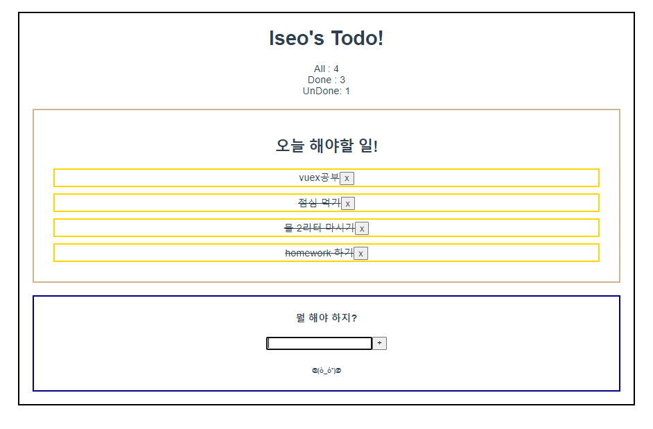

# Today I Learn 220512

오늘은 어제했던 실습을 다시 진행했는데 약간의 미적 요소를 가미해주었다. 어제는 코드를 따라치느라 흐름을 살짝 놓치면서 하는 경향이 있었는데, 오늘은 console.log를 통해 하나씩 흐름을 따라가다 보니 더 이해가 잘 되고 vuex에 대해 더 잘 알 수 있었다.


vuex는 core concepts인 actions, getters, mutations, state만 잘 알아두면 상황에 따라 적절하게 쓸 수 있는 라이브러리 같다.



### 오늘 다시 구현한 소스코드

---

### index.js

```js
import Vue from 'vue'
import Vuex from 'vuex'
import createPersistedState from 'vuex-persistedstate'

Vue.use(Vuex)

export default new Vuex.Store({
  plugins: [
    createPersistedState()
  ],
  state: {
    todos : [
      {
        title: "vuex공부",
        done: false,
        date: new Date().getTime(),
      },{
        title:"점심 먹기",
        done: false,
        date: new Date().getTime()+1,
      },{
        title:"물 2리터 마시기",
        done: false,
        date: new Date().getTime()+2,
      }
    ]
  },
  getters: {
    done(state){
      return state.todos.filter(todo=> todo.done===true).length
    },
    undone(state){
      return state.todos.filter(todo=> todo.done===false).length
    },
    all(state){
      return state.todos.length
    }
  },
  mutations: {

    CREATE_TODO(state,todoItem){
      // console.log(`안녕 ${todoItem}`)
      // console.dir(todoItem)
      state.todos.push(todoItem)
    },
    DELETE_TODO(state,todoItem){
      const todoIndex = state.todos.indexOf(todoItem)
      state.todos.splice(todoIndex,1)

    },
    UPDATE_TODO(state,todoItem){
      //state를 안바꿔주는 코드임.. mutations는 state를 바꿔야함!
      // const index = state.todos.indexOf(todo)
      // state.todos[index].done = !state.todos[index].done  
      // todo.done = !todo.done

      state.todos = state.todos.map(todo=>{
        if(todo===todoItem){
          //수정로직
          todo.done = !todo.done
        }
        return todo
      })

    }
  },
  actions: {
    createTodo({commit},todoItem){
      // console.log(`안녕 ${todoItem}`)
      // console.dir(todoItem)
      commit('CREATE_TODO',todoItem)
    },
    deleteTodo({commit},todoItem){
      commit('DELETE_TODO',todoItem)
    },
    updateTodo({commit},todoItem){
      commit('UPDATE_TODO',todoItem)
    }
  },
  modules: {
  }
})

```


### App.vue

```vue
<template>
  <div id="app">
    <h1>Iseo's Todo!</h1>
    All : {{all}}
    <br>
    Done : {{done}}
    <br>
    UnDone: {{ undone }}
    <TodoList/>
    <TodoForm/>

  </div>
</template>

<script>
import TodoForm from '@/components/TodoForm.vue'
import TodoList from '@/components/TodoList.vue'

export default {
  name: 'App',
  components: {
    TodoForm,
    TodoList,
  },
  computed:{
    done(){
      return this.$store.getters.done
    },
    undone(){
      return this.$store.getters.undone
    },
    all(){
      return this.$store.getters.all
    }
  }

}
</script>

<style>
#app {
  font-family: Avenir, Helvetica, Arial, sans-serif;
  -webkit-font-smoothing: antialiased;
  -moz-osx-font-smoothing: grayscale;
  text-align: center;
  color: #2c3e50;
  margin-top: 60px;
  border: 3px solid black;
  margin: 30px;

}
</style>

```


### TodoList.vue

```vue
<template>
  <div class="TodoList">
    <h2>오늘 해야할 일!</h2>
    <TodoListItem v-for="todo in todos" :key="todo.date" :todo="todo"/>
  </div>
</template>

<script>
import TodoListItem from '@/components/TodoListItem.vue'
import {mapState} from 'vuex'

export default {
  name: 'TodoList',
  components: {
    TodoListItem,
  },
  computed:{
    ...mapState(['todos'])
    // todos(){
    //   return this.$store.state.todos
    // }
  }
}
</script>

<style>
  .TodoList{
    border : 3px solid tan;
    margin-bottom:  20px;
    padding: 20px;
    margin: 20px;
      }
</style>

```


### TodoListItem.vue

```vue
<template>
  <div class="TodoListItem">
  <!-- <p>TodoListItem</p> -->
  <span :class="{'is-done':todo.done}" @click="updateTodo">{{todo.title}}</span>
  <button @click="deleteTodo">x</button>

  </div>
</template>

<script>

export default {
  name: 'TodoListItem',
  props:{
    todo:{
      type: Object,
    }
  },
  methods: {
    deleteTodo(){
      this.$store.dispatch('deleteTodo',this.todo)
    },
    updateTodo(){
      this.$store.dispatch('updateTodo',this.todo)
    },
  },
  created(){
    console.log(this.$store.getters)
  }

}
</script>

<style>
.TodoListItem{
  border : 3px solid gold;
  margin: 10px;
}
.is-done{
  text-decoration-line: line-through;
}

</style>

```


### TodoForm.vue

```vue
<template>
  <div @click="FormClick" class="TodoForm">
    <h4>뭘 해야 하지?</h4>
    <input type="text" ref="cursor" class="test" v-model="todoTitle" @keyup.enter="createTodo">
    <button @click="createTodo">+</button>
    <h6>ᕦ(ò_óˇ)ᕤ</h6>
  </div>
</template>

<script>


export default {
  name: 'TodoForm',

  data(){
    return {
      todoTitle:'',
    }
  },
  // created(){
  //   console.log(this.ssafy)
  //   console.log(this.todoTitle)
  // },
  // mounted(){
  //   console.log(this.ssafy)
  //   console.log(this.todoTitle)
  // },
  // updated(){
  //   console.log(this.ssafy)
  //   console.log(this.todoTitle)

  // },
  methods :{
    createTodo(){
      const todoItem = {
        title:this.todoTitle,
        done: false,
        date: new Date().getTime()+2,
      }
      if(this.todoTitle){
        this.$store.dispatch('createTodo', todoItem)
      }
      this.todoTitle=''
    },
    FormClick(){
      this.$refs.cursor.focus()
    }

  }

}
</script>

<style>
.TodoForm{
  border : 3px solid darkblue;
  margin: 20px;
}

</style>

```

